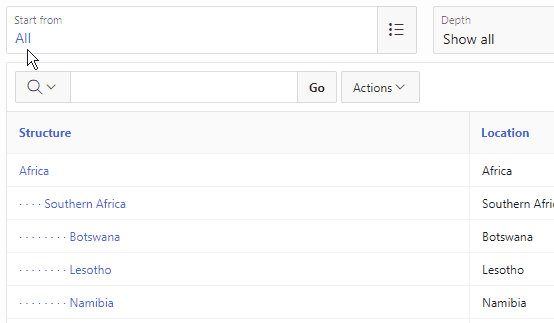

# parent-trail
Parent Trail plugin item for Oracle Apex

# Introduction
A page item plugin for use with tables that have a parent_id (or similar) to display an item with its full path 
down through the structure ... and to and allow the user to click on elements to rise up through the hierarchy. 
This is just like breadcrumbs and really helps the user navigate in hierarchical tables



# Features
- Looks like and mirrors in most respects the behavior of the normal popup LOV
- But shows full 'clickable' path to a record
- Javascript API for Apex supported
- Compact code, so minimal loading overhead
- Tested with Apex 19.1, 18.1, 18.2, 5.1.4

# Want to see what it is like?
Go to [Parent Trail Demo](https://apex.oracle.com/pls/apex/f?p=69472)

# Licence
MIT

# Credits
I would like to thank [Bartosz Ostrowski](https://github.com/bostrowski) for providing me with invaluable guidance on developing this plugin 

# How to install the plugin
Download and install `ParentTrail Plugin.sql`
If you'd like the demo application itself, download and install `ParentTrail Demo.sql`. Please include the option of 
installing accompanying objects so that sample data is created for you

# How to use
Use like a normal popup LOV, but you need to tweak the definition of the query to return three columns. The first 
column “r” is the value that the item should have if this record is selected. The second and third columns are basically
a trail from the top of the hierarchy through to the current record with segments separated by colons. The second column “d” 
specifically picks out the values as it goes along, while the third column “s” picks out what needs to be displayed as it
goes along. For a table "locations" with id, parent_id, and location columns, here is a sample query:
```sql
select
    id                                 as r,
    sys_connect_by_path(id,       ':') as d,
    sys_connect_by_path(location, ':') as s
from 
    ptrail_locations
start with 
    parent_id is null
connect by 
    prior id = parent_id
order siblings by 
    location
```
Custom attributes:
- Separator used between links in the displayed trail. Can be a single character or a whole html sequence
- Yes/No option of whether to include the popup search button on the right

# Roadmap
- Improve accessibility starting with support for application level control of plugin link color
- Add support for icon attribute
- Add custom attribute to allow developer to steer the initial population of records displayed in popup. At moment the full record table is shown, but you might want to start with the current selection and its descendants
- Support keyboard triggered paging in popup
- Add support for RTL

# Changelog
1.1 Initial version

1.1b Minor fixes from initial release

1.1c Backwards compatibility extended back to 5.1.4 and 18.1

# Known issues
- Page down and up buttons not yet processed by popup dialog if search field has focus

Please log any new issues in the github issue trail and I will deal with them as soon as possible
[Parent trail issues](https://github.com/robertabarton/parent-trail/issues)

## About Author
Author | Github | LinkedIn | E-mail
-------|--------|---------|-------
Robert Barton | [github.com/robertabarton](//github.com/robertabarton) | www.linkedin.com/in/robert-adrian-barton | robert.barton@gitm.biz


